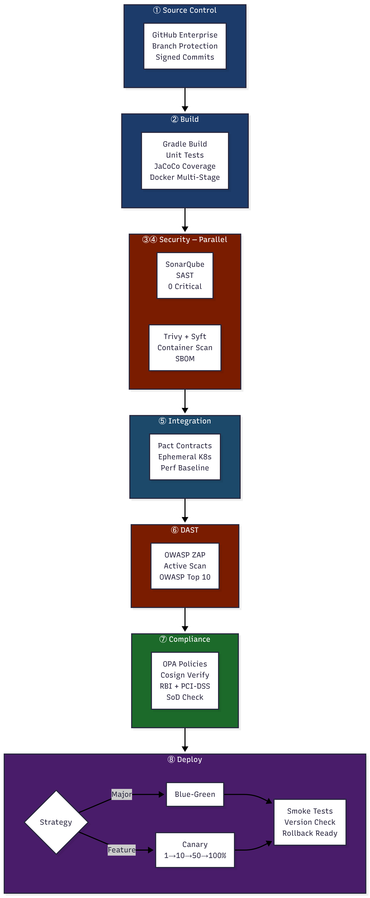

# Deliverable 1: Eight-Stage CI/CD Pipeline Architecture
**Project:** NovaPay Digital Bank — Zero-Downtime CI/CD Pipeline  
**Author:** Gaurav Durge  
**Status:** ✅ Complete  
**Last Updated:** Day 2

---

## 1. Overview

NovaPay Digital Bank currently deploys via manual SSH with a 4.5-hour MTTR and fortnightly release cycles. This document defines a production-grade, eight-stage CI/CD pipeline that transforms NovaPay into an organisation capable of deploying multiple times per day while maintaining full RBI and PCI-DSS compliance.

### Pipeline Design Principles
- **Shift-left security** — vulnerabilities caught at source, not production
- **Compliance-as-code** — every regulatory requirement is an automated gate
- **Zero manual steps** — humans approve, machines execute
- **Fail fast** — cheap stages run first; expensive stages run after
- **Parallel where possible** — SAST, dependency scan, and container scan run concurrently to meet the <2 hour commit-to-production target

---

## 2. Pipeline Architecture Diagram



---

## 3. Pipeline Timing & SLA Targets

The pipeline must complete commit-to-production in **under 2 hours**. Below is the stage-by-stage timing breakdown with parallelisation opportunities annotated.

| Stage | Tool | SLA Target | Parallelisable | Est. Duration |
|---|---|---|---|---|
| 1. Source Control & Trigger | GitHub Enterprise | < 30s | — | ~30s |
| 2. Build & Compilation | Gradle + Docker | < 8 min | No (dependency) | ~7 min |
| 3. SAST | SonarQube | < 10 min | ✅ Yes (with Stage 4) | ~8 min |
| 4. Dependency & Container Scan | Trivy + Syft | < 8 min | ✅ Yes (with Stage 3) | ~6 min |
| 5. Integration & Contract Testing | Pact + JUnit | < 15 min | No (needs Stage 3+4) | ~12 min |
| 6. DAST | OWASP ZAP | < 20 min | No (needs staging deploy) | ~18 min |
| 7. Policy & Compliance Gates | OPA + Kyverno | < 3 min | No (final check) | ~2 min |
| 8. Deployment & Verification | ArgoCD + Istio | < 15 min | No (sequential) | ~12 min |
| **Total (with parallelisation)** | | | | **~76 min ✅** |

> **Parallelisation benefit:** Stages 3 and 4 run concurrently, saving ~6 minutes. Total pipeline runtime of ~76 minutes comfortably meets the <2 hour target and the **developer feedback loop** (Stages 1-3) completes in under 10 minutes.

---

## 4. Stage-by-Stage Specifications

### Stage 1: Source Control & Trigger

**Purpose:** Enforce code quality at the entry point. No untrusted code enters the pipeline.

| Attribute | Specification |
|---|---|
| **Tool** | GitHub Enterprise |
| **Branch Strategy** | Trunk-Based Development — feature branches <24 hours |
| **Trigger Events** | Push to `main`, Pull Request opened/updated, Tag push (`v*`) |
| **Signed Commits** | GPG/SSH key validation mandatory — unsigned commits rejected |
| **Branch Protection** | Direct push to `main` blocked; minimum 1 reviewer approval |
| **Monorepo Triggering** | Path-based filtering — only changed service pipelines run |
| **Hotfix Path** | `hotfix/*` branches — expedited pipeline, all gates still enforced |
| **SLA Target** | < 30 seconds from push to pipeline trigger |
| **Failure Mode** | PR blocked; developer notified via GitHub status check |

**Key Rule for NovaPay:** Emergency hotfixes bypass staging promotion but NEVER bypass SAST, DAST, or compliance gates. Speed without safety is prohibited.

---

### Stage 2: Build & Compilation

**Purpose:** Produce a reproducible, versioned, tested build artefact.

| Attribute | Specification |
|---|---|
| **Tool** | Gradle 8.x + Docker BuildKit |
| **Build Type** | Multi-stage Docker build (builder → runtime image) |
| **Base Image** | `eclipse-temurin:21-jre-alpine` — minimal attack surface |
| **Layer Caching** | GitHub Actions cache for Gradle dependencies + Docker layers |
| **Unit Tests** | JUnit 5 — executed during build; 0 test failures tolerated |
| **Code Coverage** | JaCoCo — ≥80% line coverage, ≥70% branch coverage |
| **Versioning** | SemVer: `MAJOR.MINOR.PATCH+{git-sha}.{timestamp}.{run-id}` |
| **Image Tagging** | `novapay-app:1.2.3` AND `novapay-app:abc1234` — never `latest` |
| **Artefact Registry** | JFrog Artifactory — signed push after build success |
| **SLA Target** | < 8 minutes |
| **Failure Mode** | Pipeline blocked; build log published to PR comment |

**Dependency Lock Enforcement:** `gradle.lockfile` must exist and be committed. Any unlocked dependency fails the build immediately.

---

### Stage 3: Static Analysis & SAST

**Purpose:** Detect security vulnerabilities and code quality issues before they reach runtime.

| Attribute | Specification |
|---|---|
| **Tool** | SonarQube Community + custom banking quality profile |
| **Custom Rules** | PII handling patterns, hardcoded credentials, SQL injection, weak encryption |
| **Severity Threshold** | 0 Critical findings, ≤2 High findings |
| **Coverage Gate** | ≥80% line coverage (enforced in SonarQube quality gate) |
| **Technical Debt** | ≤5% debt ratio for new code |
| **Trend Gating** | New issues introduced by this PR blocked if severity Critical/High |
| **Parallelised With** | Stage 4 (runs concurrently) |
| **SLA Target** | < 10 minutes |
| **On Failure** | Pipeline blocked; auto-ticket created in Jira; CISO approval required within 24h |
| **Exception Process** | CISO signs risk acceptance form; 72h remediation window maximum |
| **RBI Mapping** | Section 5.1 — Vulnerability assessment regularly performed |
| **PCI-DSS Mapping** | Requirement 6.2 — Bespoke software security |

---

### Stage 4: Dependency & Container Scanning

**Purpose:** Verify all third-party components and the container image are free of critical vulnerabilities.

| Attribute | Specification |
|---|---|
| **Container Scanner** | Trivy v0.50+ |
| **Dependency Scanner** | Grype (cross-validation with Trivy) |
| **SBOM Tool** | Syft — generates CycloneDX 1.5 format |
| **SBOM Archive** | Stored in JFrog Artifactory alongside image, immutable |
| **CVE Gating** | Critical CVE → pipeline blocked immediately |
| **High CVE Gating** | CVSS ≥8.0 → pipeline blocked; CVSS <8.0 → warning only |
| **Licence Compliance** | GPL, AGPL, SSPL → pipeline blocked; MIT, Apache 2.0 → allowed |
| **Base Image Check** | Provenance verified against JFrog Artifactory trusted registry |
| **Parallelised With** | Stage 3 (runs concurrently) |
| **SLA Target** | < 8 minutes |
| **On Failure** | 72h remediation window; alternative: base image upgrade |
| **RBI Mapping** | Section 7.2 — Third-party risk management |
| **PCI-DSS Mapping** | Requirement 6.3 — Security vulnerabilities |

---

### Stage 5: Integration & Contract Testing

**Purpose:** Verify NovaPay's services integrate correctly and API contracts are not broken.

| Attribute | Specification |
|---|---|
| **Contract Testing** | Pact framework — consumer-driven contracts |
| **Pact Broker** | Self-hosted Pact Broker — contracts versioned with SemVer |
| **Integration Environment** | Ephemeral Kubernetes namespace per PR — destroyed after test |
| **Database** | Test PostgreSQL with Flyway migrations applied on spin-up |
| **Test Data** | Synthetic data only — no production data in test environments |
| **API Compatibility** | Backward compatibility verified — breaking changes blocked |
| **Performance Baseline** | p99 latency < 500ms under 2x expected production load |
| **SLA Target** | < 15 minutes |
| **On Failure** | PR blocked; contract diff published to PR comment |
| **PCI-DSS Mapping** | Requirement 6.5 — Change management processes |

---

### Stage 6: Dynamic Analysis & DAST

**Purpose:** Test the running application for vulnerabilities that only appear at runtime.

| Attribute | Specification |
|---|---|
| **Tool** | OWASP ZAP 2.14+ |
| **Scan Mode** | Active scan (not passive only) — full attack simulation |
| **Target Environment** | Staging environment with anonymised data |
| **Authentication** | ZAP authenticated scanning with dedicated test credentials (Vault-managed) |
| **API Scanning** | OpenAPI/Swagger spec provided to ZAP for complete API coverage |
| **Severity Threshold** | 0 Critical or High from OWASP Top 10 → pipeline passes |
| **False Positive Process** | Security team reviews and suppresses with documented justification |
| **SLA Target** | < 20 minutes |
| **On Failure** | Pipeline blocked; Risk Acceptance Form required + TRC approval |
| **RBI Mapping** | Section 5.1 — Vulnerability assessment |
| **PCI-DSS Mapping** | Requirement 6.4 — Public-facing web app protection, 11.3 — Pen testing |

---

### Stage 7: Policy & Compliance Gates

**Purpose:** Enforce regulatory requirements as automated code — the final checkpoint before production.

| Attribute | Specification |
|---|---|
| **K8s Policy Engine** | OPA Gatekeeper + Kyverno (defence-in-depth) |
| **Image Signing** | Cosign — all images must be signed; unsigned images rejected by admission controller |
| **IaC Scanning** | Checkov — Terraform files scanned before apply |
| **Policies Enforced** | No privileged containers, resource limits mandatory, no `latest` tag, mTLS required |
| **RBI Codification** | Sections 4.2, 4.3, 5.4, 6.1 as OPA Rego policies |
| **PCI-DSS Checks** | Network segmentation, encryption-in-transit (TLS 1.3 minimum), audit logging enabled |
| **SoD Enforcement** | Developer who wrote code cannot approve their own deployment — RBAC enforced |
| **Audit Trail** | Every gate result logged to immutable S3 bucket in JSON format with timestamp, committer, approver |
| **SLA Target** | < 3 minutes |
| **On Failure** | Deployment rejected; dual approval override available for critical fixes only |
| **RBI Mapping** | Sections 4.2, 4.3, 5.4, 6.1 |
| **PCI-DSS Mapping** | Requirements 6.5, 10.2 |

---

### Stage 8: Deployment & Verification

**Purpose:** Deploy to production with zero downtime and verify the deployment succeeded.

| Attribute | Specification |
|---|---|
| **GitOps Tool** | ArgoCD 2.x — declarative, Git-driven deployments |
| **Service Mesh** | Istio — VirtualService for traffic splitting |
| **Major Release Strategy** | Blue-Green — atomic traffic switch via Istio VirtualService |
| **Feature Release Strategy** | Canary — 1% → 10% → 50% → 100% with health checks |
| **Post-Deploy Smoke Tests** | 15 critical path tests — payment initiation, balance check, auth |
| **Version Consistency** | All pods verified running same image SHA before traffic switch |
| **Synthetic Monitoring** | Grafana synthetic transactions every 30s post-deploy |
| **Rollback Trigger** | HTTP 5xx > 5% for 60s → automatic rollback, no human needed |
| **Deployment Window** | Blocked during blackout periods (salary days, peak hours, festivals) |
| **SLA Target** | < 15 minutes |
| **On Failure** | Automated rollback to last known good deployment |
| **RBI Mapping** | Section 4.2 — Change management, 6.3 — Incident management |
| **PCI-DSS Mapping** | Requirement 6.5 — Change management processes |

---

## 5. Pipeline Failure Decision Tree

```
Pipeline Stage Fails
        │
        ├── Stage 1 (Source Control)
        │       └── PR blocked → Developer fixes → Re-push
        │
        ├── Stage 2 (Build)
        │       └── Build log to PR comment → Developer fixes
        │
        ├── Stage 3 (SAST) — Critical finding
        │       └── Auto-ticket → CISO approval (24h) → Remediate or Risk Accept
        │
        ├── Stage 4 (Dependency Scan) — Critical CVE
        │       └── 72h remediation window → Upgrade dependency → Re-scan
        │
        ├── Stage 5 (Integration Test)
        │       └── Contract diff to PR → API fix → Re-run
        │
        ├── Stage 6 (DAST) — Critical finding
        │       └── Risk Acceptance Form → TRC approval → Document exception
        │
        ├── Stage 7 (Compliance Gate)
        │       └── Deployment rejected → Dual approval override (emergency only)
        │
        └── Stage 8 (Deploy) — Smoke test failure
                └── Automatic rollback → SEV-2 incident raised → Postmortem
```

---

## 6. Branching Strategy

NovaPay uses **Trunk-Based Development**:

```
main (protected)
  │
  ├── feature/NOVA-123-payment-gateway  ← lives <24 hours
  ├── feature/NOVA-456-kyc-api          ← lives <24 hours
  └── hotfix/NOVA-789-critical-fix      ← expedited pipeline, all gates enforced
```

**Rules:**
- No direct commits to `main`
- All merges via Pull Request with minimum 1 reviewer
- Reviewer cannot be the same person who wrote the code (SoD)
- Feature branches deleted after merge
- `main` always deployable — every commit is a potential release

---

## 7. Artefact Versioning & Supply Chain Security

```
Developer Commit (Git SHA: abc1234)
        │
        ▼
Docker Image Built: novapay-app:2.1.4+abc1234.20250608.1234
        │
        ▼
Cosign Signs Image → Signature stored in JFrog Artifactory
        │
        ▼
Syft Generates SBOM → CycloneDX JSON → Stored alongside image
        │
        ▼
Kyverno Admission Controller → Rejects any unsigned image at deploy time
        │
        ▼
ArgoCD Deploys → Only signed, scanned, approved images reach production
```

**Chain of Trust:** Every container running in NovaPay production can be traced back to the exact Git commit, developer, pipeline run, scan results, and approvals that produced it.

---

## 8. Configuration Management

Following the "**same artefact, different config**" principle:

| Layer | Tool | Example |
|---|---|---|
| Base config | `values.yaml` | Shared across all environments |
| Environment override | `values-{env}.yaml` | DB URL, replica count per environment |
| Service override | `values-{service}-{env}.yaml` | Per-service customisations |
| Secrets | HashiCorp Vault | Injected at runtime — never in Git |
| Feature Flags | LaunchDarkly-style toggle | Same image, feature toggled per env |

---

## 9. Cross-References

| Topic | See Also |
|---|---|
| Blue-Green & Canary detail | [Deliverable 2: Deployment Strategies](../02-deployment-strategies/deployment-strategies.md) |
| Compliance gate thresholds | [Deliverable 3: Compliance Gates](../03-compliance-gates/compliance-gates.md) |
| Database migration in Stage 8 | [Deliverable 4: DB Migration](../04-database-migration/db-migration.md) |
| Environment promotion rules | [Deliverable 5: Environment Promotion](../05-environment-promotion/env-promotion.md) |
| Rollback trigger thresholds | [Deliverable 6: Rollback Specification](../06-rollback-specification/rollback-spec.md) |
| Post-deploy runbook | [Deployment Runbook](../../runbooks/deployment-runbook.md) |
| DORA metrics & dashboards | [Deliverable 8: Observability](../08-observability/observability.md) |


