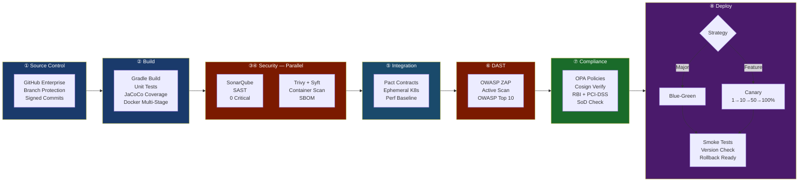
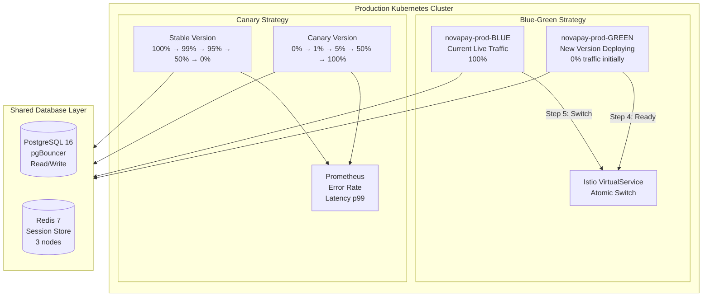
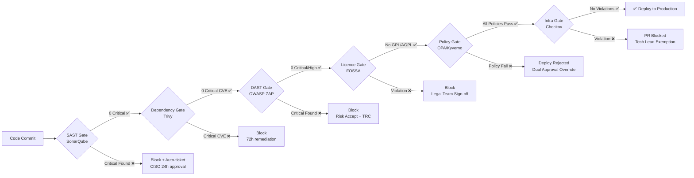

# Pipeline Architecture Diagrams

## Diagram 1: Full 8-Stage Pipeline Flow

> Copy this code into https://mermaid.live to generate the PNG diagram.
> Export as PNG and save as `pipeline-overview.png` in this folder.

---

## Diagram 2: Deployment Strategy Detail

---

## Diagram 3: Compliance Gate Chain

---

## How to Generate PNG Diagrams

1. Go to **https://mermaid.live**
2. Paste each diagram code block above
3. Click **Download PNG**
4. Save in this `/diagrams/` folder as:
   - `pipeline-overview.png`
   - `deployment-strategy.png`
   - `compliance-gate-chain.png`
5. Embed in architecture.md using: ``

